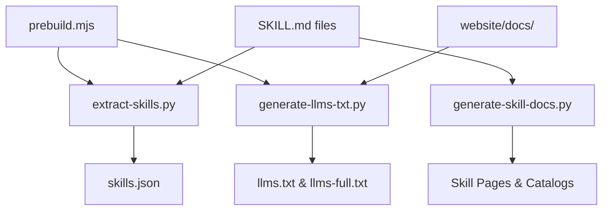

# website — scripts

# Website Scripts Module

The `website/scripts` module contains the automation logic required to synchronize the Hermes Agent documentation and skill metadata with the Docusaurus-based website. These scripts transform raw repository content (Markdown files, YAML metadata, and cached indexes) into structured data and web-ready documentation pages.

## The Prebuild Pipeline

The primary entry point for this module is `prebuild.mjs`. This script is executed automatically during `npm run start` or `npm run build` to ensure the website's data is up-to-date.

### prebuild.mjs
A Node.js wrapper that orchestrates the Python scripts. It includes fallback logic: if `python3` or `pyyaml` is missing on the local machine, it writes an empty `skills.json` to allow the Docusaurus build to proceed without failing, though the Skills Hub will be empty.

## Skill Metadata Extraction

### extract-skills.py
This script aggregates skill metadata from multiple sources into a single JSON file used by the website's "Skills Hub."

*   **Sources:**
    *   **Local Skills:** Scans `skills/` and `optional-skills/` for `SKILL.md` files.
    *   **Cached Indexes:** Processes JSON files in `skills/index-cache/` (e.g., community skills from Anthropic, OpenAI, or LobeHub).
*   **Processing Logic:**
    *   **Category Mapping:** Uses `CATEGORY_LABELS` to normalize directory names into human-readable labels.
    *   **Category Guessing:** For external skills without explicit categories, `_guess_category` uses a tag-to-category mapping.
    *   **Consolidation:** Categories with fewer than 4 skills are moved to "Other" via `_consolidate_small_categories` to prevent UI clutter.
*   **Output:** Generates `website/src/data/skills.json`.

## Automated Skill Documentation

### generate-skill-docs.py
This script converts the raw `SKILL.md` files found in the repository into Docusaurus-compatible Markdown pages. This ensures that every skill has a dedicated, searchable page in the documentation.

*   **MDX Safety:** Since Docusaurus uses MDX, raw Markdown can break the build if it contains unescaped `{` or `<` characters. The `mdx_escape_body` and `escape_text` functions sanitize the content while preserving valid HTML tags (like `` or ` `) and fenced code blocks.
*   **ASCII Guard:** If a skill's documentation contains box-drawing characters (common in ASCII diagrams), `_wrap_ascii_art_code_blocks` wraps the block in `<!-- ascii-guard-ignore -->` to bypass documentation linting rules.
*   **Link Rewriting:** `rewrite_relative_links` converts relative file paths (e.g., `./templates/config.json`) into absolute GitHub URLs, as these supporting files are not copied to the website.
*   **Catalog Generation:**
    *   Updates `website/docs/reference/skills-catalog.md` (Bundled skills).
    *   Updates `website/docs/reference/optional-skills-catalog.md` (Installable skills).
*   **Sidebar Management:** `write_sidebar` programmatically modifies `website/sidebars.ts` to include the generated catalogs without overwhelming the navigation with hundreds of individual skill links.

## Documentation for LLMs

### generate-llms-txt.py
Generates agent-friendly versions of the documentation, following the `llms.txt` proposal.

*   **llms.txt:** A curated, high-level index of the documentation. It uses the `SECTIONS` constant to define a narrative flow (Getting Started -> Using Hermes -> Core Features, etc.) rather than a raw filesystem crawl.
*   **llms-full.txt:** A massive concatenation of all documentation files. 
    *   **Ordering:** Prioritizes the curated `SECTIONS` first to ensure the most important context appears within the token window of most LLMs.
    *   **Source Attribution:** Injects `<!-- source: path/to/file.md -->` comments before each section to help agents identify the origin of the information.
*   **Pathing:** Outputs to `website/static/`. Note that Docusaurus serves the `static/` directory at the `/docs/` base path, making these available at `/docs/llms.txt`.

## Key Functions and Patterns

| Function | Script | Purpose |
|:---|:---|:---|
| `read_frontmatter` | `generate-llms-txt.py` | Extracts YAML metadata and body text from Markdown files. |
| `derive_skill_meta` | `generate-skill-docs.py` | Determines category and slug based on the `skills/` directory structure. |
| `render_skill_page` | `generate-skill-docs.py` | Templates the final Docusaurus Markdown, including metadata tables. |
| `_guess_category` | `extract-skills.py` | Assigns categories to external skills based on keyword matching in tags. |
| `runPython` | `prebuild.mjs` | Safely executes Python scripts and handles `ENOENT` errors. |