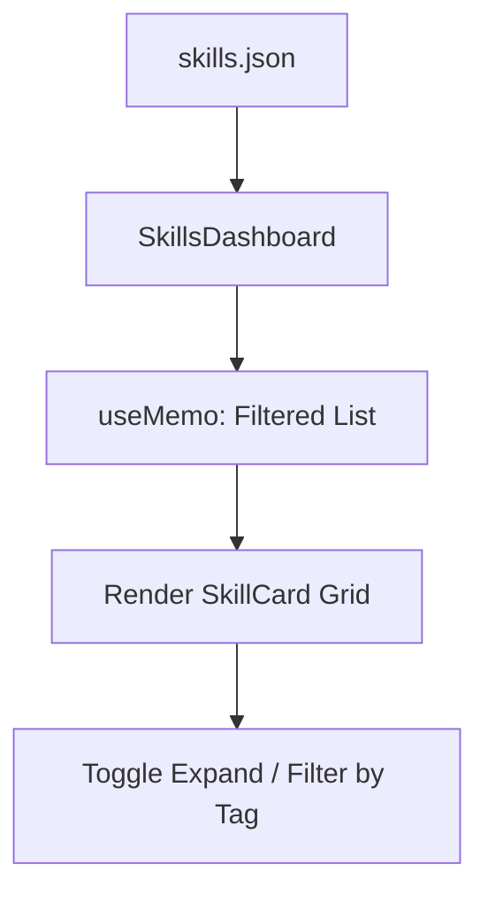

# website — src

# Website Source Module

The `website/src` module contains the frontend components, pages, and global styling for the Hermes Agent documentation and marketing site. Built on Docusaurus, it implements a custom "terminal aesthetic" using a dark amber-on-black color palette and provides interactive dashboards for exploring the Hermes ecosystem.

## Global Styling and Theme

The site's visual identity is defined in `src/css/custom.css`. It overrides Docusaurus defaults to match the Hermes Agent branding.

### Terminal Aesthetic
- **Color Palette**: Uses a primary amber/gold color (`#FFD700` in dark mode, `#8B6508` in light mode).
- **Typography**: Utilizes `Inter` for UI text and `JetBrains Mono` for code and technical data.
- **Backgrounds**: Implements a subtle radial-gradient dot grid on `.main-wrapper` to simulate a retro-tech feel.
- **Component Overrides**: Customizes Docusaurus admonitions, tables, and navigation menus with gold-tinted borders and translucent backgrounds.

## Skills Hub (`SkillsDashboard`)

Located at `src/pages/skills/index.tsx`, this component provides a searchable catalog of agent capabilities. It consumes data from `src/data/skills.json`.

### Data Architecture
The dashboard manages a collection of `Skill` objects:
```typescript
interface Skill {
  name: string;
  description: string;
  category: string;
  categoryLabel: string;
  source: string; // e.g., 'built-in', 'optional', 'LobeHub'
  tags: string[];
  platforms: string[];
  author: string;
  version: string;
}
```

### Key Features
- **Multi-faceted Filtering**: Users can filter by registry source (via `sourceFilter`) and functional category (via `categoryFilter`).
- **Search with Highlighting**: The `highlightMatch` function performs case-insensitive substring matching across names and descriptions, wrapping matches in `<mark>` tags.
- **Interactive Cards**: The `SkillCard` component supports an expanded state to show metadata (author, version, tags) and a CLI installation hint (`hermes skills install <name>`).
- **Performance**: Filtering and category count aggregations are wrapped in `useMemo` to prevent expensive recalculations on every keystroke.

### Execution Flow


## User Stories Collage

Located at `src/components/UserStoriesCollage/index.tsx`, this component displays community use cases in a masonry-style grid.

### Masonry Layout
Unlike standard grids, this component uses CSS `column-count` (defined in `styles.module.css`) to create a "true collage" feel where tiles of different heights (defined by `size: 'sm' | 'md' | 'lg'`) stack efficiently.

### Dynamic Styling
The component uses a mapping object `CATEGORIES` to assign specific accent colors and gradients to tiles based on their metadata. These are passed to the DOM via CSS variables:
```tsx
style={{
  '--tile-accent': cat.strip,
  '--tile-accent-solid': cat.solid,
  '--tile-accent-soft': cat.soft,
} as React.CSSProperties}
```

### Source Mapping
The `sourceColor` helper function assigns brand-specific colors to badges based on the origin of the story (e.g., X/Twitter, Hacker News, Reddit, GitHub).

## Component Patterns

### Filter Buttons
Both the Skills Hub and User Stories use a consistent "Pill" filter pattern. Buttons display the count of items available in that category, calculated via `useMemo` loops over the raw data sets.

### Responsive Design
- **Mobile Sidebar**: The Skills Hub implements a `sidebarToggle` and a `backdrop` for mobile users, as the standard desktop sidebar is hidden via media queries at widths below 900px.
- **Grid Scaling**: The User Stories grid scales from 4 columns on desktop down to 1 column on mobile devices using standard CSS breakpoints.

### Search UX
The Skills Hub implements a global keyboard listener for the `/` key to focus the search input and `Escape` to clear focus or collapse expanded cards, mimicking IDE and documentation search patterns.