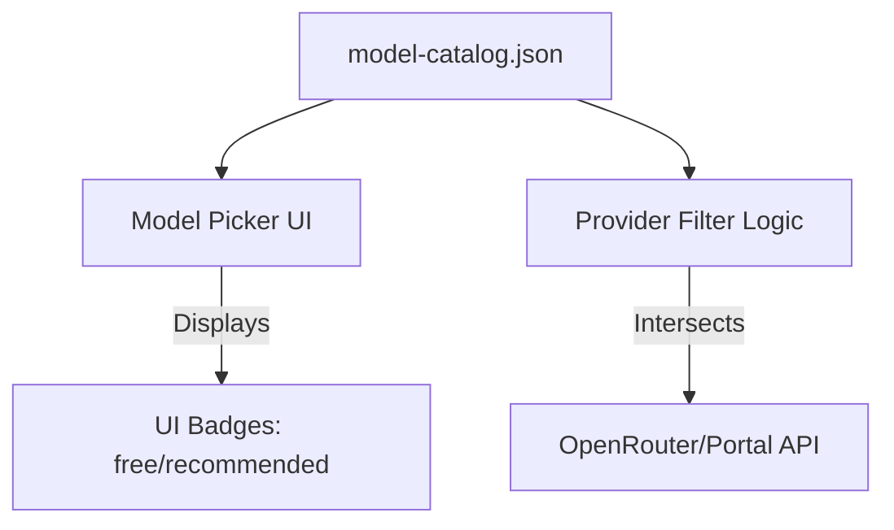

# website — static

# Website Static Assets

The `website/static` module contains non-executable assets served by the Hermes Agent web platform. The primary component is the Model Catalog, which acts as the central manifest for supported Large Language Models (LLMs) across different providers.

## Model Catalog (`/api/model-catalog.json`)

The `model-catalog.json` file is a versioned manifest used by the frontend to populate model selection interfaces and apply provider-specific metadata. It decouples the UI's model list from the application's hardcoded logic, allowing for updates to supported models without requiring a full redeploy of the core services.

### Schema Structure

| Field | Type | Description |
| :--- | :--- | :--- |
| `version` | Integer | Schema version for compatibility tracking. |
| `updated_at` | ISO8601 | Timestamp of the last manual or automated update. |
| `metadata` | Object | Source information and links to reference documentation. |
| `providers` | Object | A map of provider keys (e.g., `openrouter`, `nous`) containing model lists. |

### Provider Configurations

Each provider entry contains a `metadata` block and a `models` array.

#### OpenRouter
The OpenRouter implementation uses the `description` field in the model list to drive UI elements:
*   **Badges**: Values like `"recommended"` or `"free"` are used by the frontend picker to render visual badges next to model names.
*   **Filtering**: While this manifest provides a curated list, the application logic typically intersects this list with the live OpenRouter `/api/v1/models` endpoint to filter for tool-calling support and current availability.

#### Nous Portal
The Nous Portal configuration represents models available via the internal Nous infrastructure.
*   **Tier Gating**: Unlike OpenRouter, the "free" or "pro" status of Nous models is not determined by this static file. The application uses the `partition_nous_models_by_tier` function to determine access levels dynamically based on live Portal pricing data.

### Data Flow



## Usage in Development

### Adding a New Model
To add a model to the catalog, append a new object to the relevant provider's `models` array:

```json
{
  "id": "provider/model-name",
  "description": "recommended"
}
```

### Integration Notes
*   **Model IDs**: Ensure the `id` matches the exact string expected by the provider's completion endpoint.
*   **Descriptions**: The `description` field is currently optimized for OpenRouter. For the Nous provider, the field is optional as tiering is handled by the `partition_nous_models_by_tier` logic in the backend/client integration layer.
*   **Caching**: As a static asset under `/api/`, this file is subject to standard web caching headers. Ensure version increments if structural changes are made to the schema.