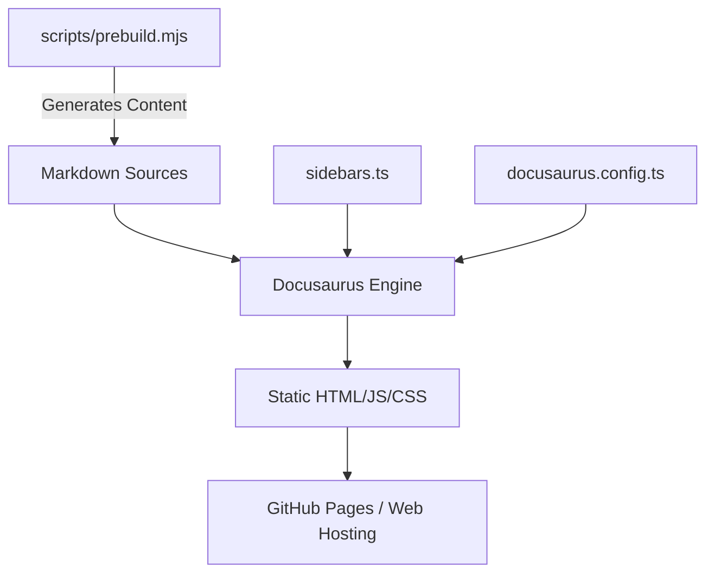

# website — website

# Hermes Agent Documentation Website

The `website` module contains the source code and configuration for the [Hermes Agent documentation](https://hermes-agent.nousresearch.com/docs/). It is built using **Docusaurus 3**, a modern static website generator, and is configured to provide a comprehensive guide for users, integrators, and developers.

## Architecture Overview

The website is structured as a documentation-only Docusaurus site (the blog feature is disabled). It serves content from the root path `/docs/`.



## Key Components

### Configuration (`docusaurus.config.ts`)
This is the central configuration file. Key settings include:
- **Search**: Uses `@easyops-cn/docusaurus-search-local`. It is configured to ignore auto-generated skill pages (under `user-guide/skills/bundled/` and `user-guide/skills/optional/`) to ensure search results prioritize human-written guides.
- **Markdown**: Supports Mermaid diagrams and uses `onBrokenLinks: 'warn'` to manage internal cross-references.
- **Theme**: Uses the Docusaurus classic preset with a custom dark-mode-first color scheme.
- **Syntax Highlighting**: Powered by Prism with support for `bash`, `yaml`, `json`, `python`, and `toml`.

### Navigation (`sidebars.ts`)
The sidebar defines the logical flow of the documentation. It is organized into several high-level categories:
- **Getting Started**: Installation and initial setup.
- **Using Hermes**: Core CLI/TUI usage and configuration.
- **Features**: Deep dives into tools, skills, memory, and automation.
- **Messaging Platforms**: Integration guides for Telegram, Discord, Slack, etc.
- **Developer Guide**: Architecture, internals, and contribution guidelines.
- **Reference**: CLI commands, environment variables, and tool catalogs.

### Pre-build Processing
The module utilizes a `scripts/prebuild.mjs` script (executed via `npm run prebuild` or `npm run prestart`). This script is responsible for preparing dynamic content or catalogs before the Docusaurus engine generates the static files.

## Development Workflow

### Installation
Install dependencies using Yarn:
```bash
yarn
```

### Local Development
Start the development server with hot-reloading:
```bash
yarn start
```
The site will typically be available at `http://localhost:3000/docs/`.

### Build and Deployment
To generate the static production build:
```bash
yarn build
```
The output is located in the `build/` directory.

To deploy to GitHub Pages:
```bash
# Using SSH
USE_SSH=true yarn deploy

# Using HTTPS
GIT_USER=<username> yarn deploy
```

## Content Standards

### Diagram Linting
The project uses `ascii-guard` to ensure documentation quality. 
- **Constraint**: Do not use ASCII box diagrams in Markdown files.
- **Requirement**: Use Mermaid code blocks (````mermaid`) or standard Markdown lists/tables.
- **Validation**: Run `yarn lint:diagrams` to check for violations.

### Search Indexing
The search plugin is configured with `indexBlog: false` and `docsRouteBasePath: '/'`. If adding new auto-generated content sections that might clutter search results, update the `ignoreFiles` regex array in `docusaurus.config.ts`.

### Styling
Custom styles are managed in `src/css/custom.css`. The site respects the user's system color scheme but defaults to `dark` mode.