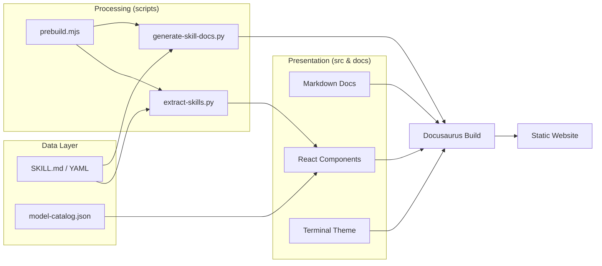

# website

# Website Module

The `website` module is a Docusaurus 3-based platform that serves as the central documentation hub for the Hermes Agent ecosystem. It integrates static technical guides, automated skill documentation, and interactive catalogs into a unified "terminal-themed" web interface.

## Module Integration

The website functions through a pipeline that transforms raw repository data into a structured documentation site:

1.  **Content Generation**: The [scripts](scripts.md) module runs a prebuild pipeline (via `prebuild.mjs`) that extracts metadata from the core repository. It processes `SKILL.md` files and YAML metadata to generate dynamic documentation pages and the `skills.json` index.
2.  **Static Documentation**: The [docs](docs.md) module provides the manual technical specifications, architecture maps, and developer guides that form the core of the site's knowledge base.
3.  **Frontend & Styling**: The [src](src.md) module defines the visual identity, using custom CSS to implement a high-contrast amber-on-black terminal aesthetic. It includes React components for interactive elements like skill cards and dashboards.
4.  **Data Manifests**: The [static](static.md) module hosts the `model-catalog.json`, which the frontend consumes to display supported LLMs and provider metadata without requiring code changes to the core engine.

## Documentation Pipeline

The following diagram illustrates how the sub-modules interact to produce the final static site:

## Key Components

- **[docs](docs.md)**: Technical reference for the `AIAgent` core, platform adapters, and system architecture.
- **[scripts](scripts.md)**: Automation tools including `generate-skill-docs.py` and `generate-llms-txt.py` for LLM-friendly documentation.
- **[src](src.md)**: Custom frontend logic, global styles (`custom.css`), and the "Inter" and "JetBrains Mono" typographic configuration.
- **[static](static.md)**: The Model Catalog manifest and other non-executable assets served at the site root.